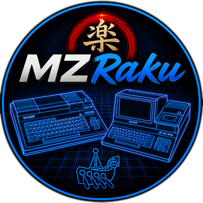

<p align="center"></p>

# MZRaku

A Sharp MZ-700 and MZ-80A emulator written in C# / .NET 8 (WinForms). The aims of this emulator are:

1. Work well enough play the MZ-700 games I remember from my childhood
2. Be useable from a launcher such as Launchbox or Playnite, taking into account the need for a lot of games to have BASIC present before they can be loaded

MZ-700 is the default; MZ-80A (the MZ-700's 1982 sibling) is available via `--mz80a` or `File → Machine → MZ-80A`. Both machines coexist in one binary and share one `settings.ini`.

This means that the goal is for the emulator to work 'well enough', and with some quality-of-life features to enable the above, without necessarily worrying too much about accurately reproducing how the actual MZ-700 hardware works. A good example of this is that MZRaku **does not** emulate the MZ-1T01 cassette drive. Cassette images (regardless of type) are loaded by directly injecting them into the machine's memory, which meets the objective of loading games quickly and easily.

Having said that, I have a fairly ambitious set of features I'd like to include in the emulator going forward. The current development roadmap can be seen [here](/docs/roadmap.md).

***
IMPORTANT NOTE - The emulator code is *entirely* AI generated. Although I have some development experience, how CPUs etc work is outside my skillset so what is here is a result of several weeks of me working with Claude to produce the features and refinements I need for my use case. I chose to use C# as it is a language I know, so I can use how the project has been put together to educate myself on what it takes to create an emulator. The choice to use WinForms, effectively tying the current implementation tightly to Windows, was also made as it suits my specific needs.

Another aim was to see whether something like this is even possible using an AI tool. I think the result is pretty impressive. It's not perfect, but it does work. I think this is an appropriate use of these tools. I don't think anyone would be using a trivial emulator such as this for anything critical to their lives.

***

## Status

The emulator runs most MZ-700 software and games, in both BASIC and machine code. MZ-80A support (added at v1.0.1-preview) covers SA-1510 monitor + SA-5510 S-BASIC boot, keyboard, cassette autoload with typed LOAD + RUN, MZ-80A native audio, and an authentic green-phosphor screen tint. There are some [outstanding limitations](#known-limitations) and things that aren't quite right. These are listed further down this file.

- Cassette images in `.mzf`/`.m12`/`.mzt` formats can be loaded via the menu, dragging and dropping them into the emulator window, or by specifying them on the command-line — the emulator will inspect the MZF and load BASIC and type 'RUN' automatically, if that is required to run the program. Machine-code programs are loaded and started directly. This flow works on both MZ-700 and MZ-80A.
- If your `.mzf`/`.m12`/`.mzt` files are within .zip archives, these can also be used directly in the same way as above. The emulator will automatically extract the .mzf file from the archive and run it.
- The default keyboard layout maps appropriate PC keys to the target machine's character set - e.g. typing a '+' on the PC keyboard will generate a '+' in the emulator, even though those keys are in relatively-different positions on actual hardware. An editor for the keyboard mappings is available under `File->Settings` (MZ-700 only — MZ-80A key overrides live in `settings.ini` for now).
- MZRaku emulates the MZ-1X03 joystick via any Windows-recognised game controller. Button mappings can be changed via `File->Settings`. Joystick emulation is MZ-700-only; MZ-80A did not ship with an equivalent add-on.
- Text files containing BASIC listings can be loaded. These are auto-typed into the emulator at about 6-8 chars per second. (Speeding this up will be a future focus)


## Quickstart

The emulator itself is freely available, but I have not included the Sharp ROM & font files or S-BASIC .mzf, all of which are really required to make the emulator useful. Other emulators seem to have included these, so I'm not necessarily worried about Sharp taking action, more about any Github rules and associated automated scanning that might make including them in the repo problematic.

You'll need to source the required files yourself (they are widely archived online) and drop them into the install directory. **MZ-700** (default):

| File | Where it goes | What it is |
|---|---|---|
| `1z-013a.rom` | `roms\` | The MZ-700 monitor ROM (4 KiB). |
| `mz700fon.int` | `roms\` | The MZ-700 character-generator ROM (font data). |
| `1Z-013B.mzf` | `basic\` (or `roms\`) | Sharp's S-BASIC interpreter, supplied on cassette. |

**MZ-80A** (only needed if you'll run `--mz80a`):

| File | Where it goes | What it is |
|---|---|---|
| `SA-1510.rom` | `roms\` | The MZ-80A monitor ROM (4 KiB). |
| `SA-CG.rom` | `roms\` | The MZ-80A character-generator ROM (font data). |
| `SA-5510.mzf` | `basic\` (or `roms\`) | Sharp's SA-5510 BASIC interpreter, supplied on cassette. |

Layout next to `MZRaku.exe`:

```
MZRaku.exe
roms\
  1z-013a.rom
  mz700fon.int
  SA-1510.rom       (only if running --mz80a)
  SA-CG.rom         (only if running --mz80a)
basic\
  1Z-013B.mzf
  SA-5510.mzf       (only if running --mz80a)
```

The first launch scans these folders, records the resolved paths in `settings.ini` (split into `[Roms.MZ700]` and `[Roms.MZ80A]` sub-sections), and starts the emulator. If a file is missing the emulator reports it and tells you exactly where it looked to find them.

### Using the emulator from a game launcher

One of the primary objectives of MZRaku is to make it much easier to launch MZ-700 games from launcher applications, so that games can be selected and will start automatically, even with the quirk of needing BASIC to be pre-loaded for most titles. This should be straightforward if you have configured other emulators within your launcher of choice, but see [Launcher setup](docs/usage/launcher-setup.md) for step-by-step instructions on wiring MZRaku into popular Windows game launchers (Launchbox so far, more to follow soon - notably Playnite).

## Building & running

The Z80 CPU emulator lives in a separate repo
([sgillon/Z80Core](https://github.com/sgillon/Z80Core)) and is
included here as a git submodule. After cloning:

```
git submodule update --init
dotnet build
dotnet run
```

If you cloned with `git clone --recurse-submodules`, the submodule step is already done.

Or once built:

```
.\[Working dir]\MZRaku.exe [--basic] [path\to\cassette.mzf]
```

### Producing a release build

```
dotnet publish -c Release -r win-x64 --self-contained false -o publish\MZRaku
```

Release publishes a single self-extracting `MZRaku.exe` which assumes the .NET 8 DesktopRuntime is installed on the target machine. Place your ROMs / BASIC alongside the exe as per [Quickstart](#quickstart) above.

## Command-line options

| Flag | Effect |
|---|---|
| `--mz700` | Force MZ-700 for this run. Overrides `[Machine] Type=` in `settings.ini` without writing back. MZ-700 is also the default when nothing is specified. |
| `--mz80a` | Force MZ-80A for this run. Overrides `[Machine] Type=` in `settings.ini` without writing back. |
| `--basic` (`-b`) | Auto-load the active machine's BASIC (S-BASIC on MZ-700, SA-5510 on MZ-80A) after the monitor is ready. Implied automatically if a BASIC program cassette file is also specified. |
| `<path>.mzf` | Auto-load a cassette image. BASIC programs will auto-load BASIC, then `RUN` will be typed automatically; machine-code images load and start directly. A `.zip` containing an `.mzf`/`.m12`/`.mzt` entry is also accepted (the first cassette entry within the archive is used). |
| `--display=N` | Override the window scale for this run: `1`, `2`, `3`, or `full`/`fs` for borderless full-screen. settings.ini is not modified — Alt+Enter or the View menu still toggle out of full-screen. |
| `--scanlines[=on\|off]` | Force the CRT-style scanlines overlay on or off for this run. Without the flag the persisted Settings → Display value wins. Doesn't write back to settings.ini unless you also touch the View → Scanlines toggle or open Settings. |
| `--dump=<file>` | At frame 120 (configurable using `--dumpframe` below), dump CPU/PIT/PPI/VRAM state to a text file and exit — useful for offline diagnostics. |
| `--dumpframe=N` | Override the dump frame number used for `--dump` above. |
| `--help` (`-h`) | Show usage. |

Examples:

```
MZRaku.exe                                 # boot into MZ-700 (default)
MZRaku.exe --basic                         # MZ-700 + S-BASIC loaded, prompt at Ready
MZRaku.exe cricket.mzf                     # MZ-700 BASIC game, auto-LOAD + auto-RUN
MZRaku.exe --mz80a                         # boot into MZ-80A monitor
MZRaku.exe --mz80a --basic                 # MZ-80A + SA-5510 BASIC
MZRaku.exe --mz80a NEW-INVADERS-80A.mzf    # MZ-80A machine-code game
```

## Menu and shortcuts

| Action | Shortcut |
|---|---|
| Load cassette… | Ctrl+O |
| Load BASIC | Ctrl+B |
| Load BASIC source… | Ctrl+Shift+B |
| Reset | Ctrl+R |
| File → Machine → MZ-700 / MZ-80A | — |
| Settings → ROMs… | Ctrl+S |
| Settings → Display… | Ctrl+Shift+D |
| Settings → Keyboard… | Ctrl+Shift+K |
| Settings → Joystick… | Ctrl+Shift+J |
| Display 1× / 2× / 3× | Ctrl+1 / Ctrl+2 / Ctrl+3 |
| Full-screen toggle | Alt+Enter |
| Scanlines toggle | Ctrl+L |
| Debugger… | Ctrl+D |
| Memory Viewer… | Ctrl+M |
| HID Diagnostic… | Ctrl+H |
| Sound Diagnostic… | — |

**Switching machines** — `File → Machine → MZ-700 / MZ-80A` writes the choice to `[Machine] Type=` in `settings.ini` and prompts to restart MZRaku so the new machine boots cleanly. For a one-off run without changing the persisted setting, use `--mz700` / `--mz80a` on the command line.

You can also drag and drop an `.mzf`/`.m12`/`.mzt` (or a `.zip` containing one) onto the window. Loading a cassette resets the emulator first, so opening a different program mid-execution will work regardless of whether the old or new program is BASIC or machine code.

All settings are stored in `settings.ini`, which is created when the emulator runs for the first time.

**File → Settings…** (Ctrl+S) opens a tabbed dialog covering Display, ROMs, and Joystick — or you can edit the INI by hand if you prefer (notes are included within each section of the created settings.ini file):

ROM and BASIC paths are written relative to the executable when possible (so the install stays portable). Absolute paths will be used if the ROM or BASIC file is outside the emulator directory. If a file is moved or deleted, the next emulator launch will re-scan the standard locations.

## Documentation

More detailed topic-by-topic guides can be found under [`docs/usage/`](docs/usage/):

- [Debugger](docs/usage/debugger.md) — execution control, register view, disassembly pane, breakpoints.
- [Memory viewer](docs/usage/memory-viewer.md) — live hex / ASCII view of the 64K address space with PC and SP highlighting.
- [HID Diagnostic](docs/usage/hid-diagnostic.md) — live view of host keyboard / joystick input and the resolved MZ-700 matrix state.
- [Keyboard](docs/usage/keyboard.md) — how host keystrokes are mapped to the MZ-700 matrix; per-key editor in Settings; Font Sheet for
  GRAPH glyphs; Import / Export `.mzkbd`; loading `.bas` source files.
- [Joystick](docs/usage/joystick.md) — MZ-1X03 emulation driven from any Windows-recognised game controller.
- [Hardware notes](docs/usage/hardware-notes.md) — MZ-700 hardware quirks the code learned the hard way (PIT topology, $E008, etc.).
- [Launcher setup](docs/usage/launcher-setup.md) — wiring MZRaku into Launchbox (and other launchers to come).
- [Project history](docs/history.md) — chronological record of major changes and architectural decisions, for the curious or for
  future-maintainer orientation.

## Project layout

```
Z80Core/         Separate class-library project (Z80Core.dll) — Z80 CPU
                 core (main, ED, CB, IX/IY prefixes) and a standalone
                 disassembler. Pure net8.0, no WinForms, no MZ-700-
                 specific code; reusable for other Z80 machines.
Hardware/        8255 PPI, 8253 PIT, memory map, keyboard (CharMap +
                 SpecialKeyMap + Mz700MatrixReference), video, sound,
                 cassette + zip loader, joystick (MZ-1X03 + WinMM
                 bridge).
UI/              All WinForms surfaces, grouped by feature area:
  Keyboard/        Diagram, per-key + per-VK editor, matrix grid,
                   capture controls — the diagram-first editing flow
                   in Settings → Keyboard plus the advanced child.
  Debugger/        DebuggerForm, MemoryViewer, Z80 test runner.
  Diagnostics/     HID Diagnostic + Font Sheet — live observation
                   windows under the Debug menu.
  Settings/        SettingsForm tabs + Joystick button capture
                   dialog.
  AboutForm.cs     Help → About dialog (icon, version, build date).
  SmoothControls.cs  Double-buffered Label / ListBox / TableLayout
                   subclasses shared by the debugger windows.
MainForm.cs      Window, menu, timer-driven RunFrame loop, CLI auto-load.
MZ700.cs         Top-level "machine" that wires CPU + I/O + ROMs.
Program.cs       Main entry point + CLI argument parsing.
Settings.cs      INI-backed user preferences (settings.ini).
docs/usage/      Topic-by-topic usage docs.
roms/            (You supply) Monitor ROM + character generator.
basic/           (You supply) S-BASIC cassette image.
games/           Joystick test program (joytest.bas / .mzf).
```

## Known limitations

- MZ-only glyphs (graphics blocks, kana) aren't reachable from a PC keystroke in the char-driven model — by design. The **Font Sheet**
  window (View → Font Sheet…, Ctrl+G) will ultimately bridge most of this gap with a click-to-type feature. However, this is not yet fully-working for all glyphs. MZ-700 only.
- MUSIC tempo rate is CPU-cycle-derived rather than driven from an emulated oscillator. It's ear-correct on MZ-700, but not precise.
- MZ-80A MUSIC pitch is currently an octave above the reference (EmuZ-80A / real hardware). Discrete notes are correct in duration and interval; only the absolute frequency is off. Tracked as a post-v1.0.1 calibration item.
- MZ-80A Settings dialog is partial-coverage: char-map, key overrides, green-screen tint, and `Mz80aInvertLetterShift` live in `settings.ini` for now (each with inline comments). A soft-amber notice inside the Settings dialog itself points this out when MZ-80A is active. Full GUI coverage is planned for a later release.
- Auto-typed input (BASIC source paste / command auto-load) runs at around 6–8 chars/sec — fine for short snippets, slow for long
  listings.
- CRT-style scanlines (Settings → Display) look right in windowed mode but degrade at full-screen scale. A proper filter (with
  intensity / line-size controls) is required.
- MZ-80A diagnostic panes (Sound Diagnostic, Font Sheet, HID Diagnostic, Keyboard Matrix) are MZ-700-shaped and show a "MZ-700 only for now" MessageBox when opened while MZ-80A is active. Debugger and Memory Viewer work on both machines.

## Planned future work

Items I'd like to come back to (rough priority order):

- **BASIC-aware debugger panes** — program lister with de-tokenised output, current-line indicator, variable-table reader.
- **Current-line highlighting** in the source view once the BASIC line pointer is wired up.
- **BASIC source editor pane** — read the live BASIC program out of RAM, render it in an editable text pane, and write edits back.
- **MUSIC tempo re-validation** — stopwatch against a real MZ-700 now that discrete notes make timing comparison meaningful.


## License

MZRaku is released under the [MIT License](LICENSE) — do what you
like with it, just keep the copyright notice.

The Z80 CPU emulator that powers MZRaku is maintained separately at
[sgillon/Z80Core](https://github.com/sgillon/Z80Core) (also MIT) and
included here as a git submodule under `Z80Core/`.

## Acknowledgements

- **Sharp Corporation** — original MZ-700 and MZ-80A hardware and ROM firmware. All ROM/BASIC files referenced in [Quickstart](#quickstart) remain
  Sharp's copyright.
- The wider **MZ-700 enthusiast community** for the disassemblies, service manuals, and games preservation work that made this project
  possible.
- Ben at **Sharpworks (https://mz-sharpworks.co.uk/)** - Ben also maintains the Sharp MZ Software Archive (https://mz-archive.co.uk/) which is an invaluable resource for MZ software. Sharpworks also publish brand new MZ titles on cassette and should be supported for that alone.
- **Anthropic Claude** — as noted at the top of this README, the entire codebase was generated through pair-programming with Claude.
